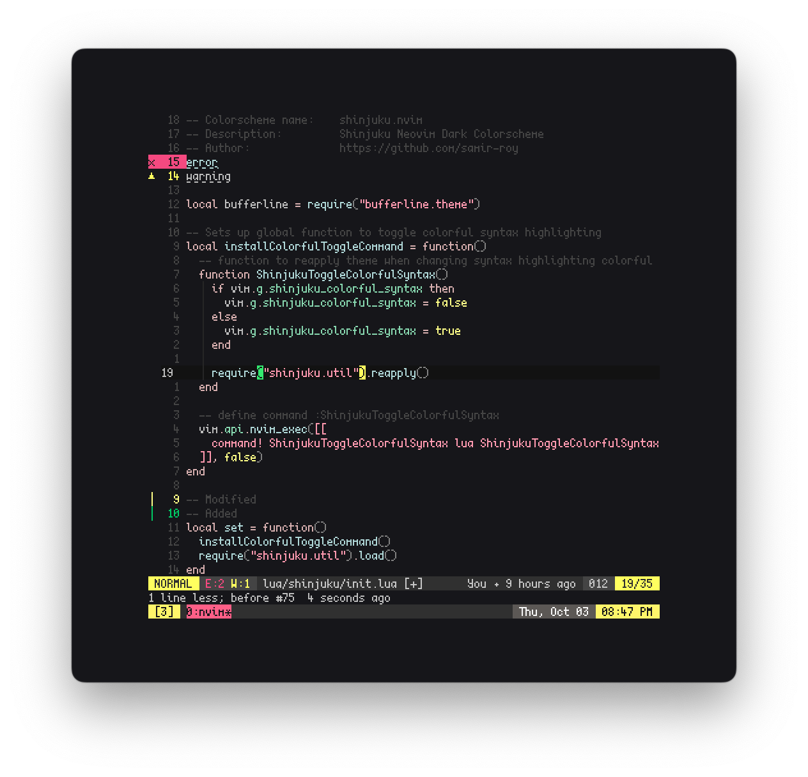

# samir-roy/shinjuku.nvim

## NeoVim dark color scheme with subtle syntax highlighting and neon markers



## Credits

Rather than starting from scratch, shaunsingh/nord.nvim was used as the base.

## Features

shinjuku.nvim is a color scheme for NeoVim written in Lua with built in support
for native LSP, [TreeSitter](https://github.com/nvim-treesitter/nvim-treesitter) and
many more plugins. It is a dark theme with subtle syntax highlighting that doesn't
distract, along with bright neon markers and selections that are easily noticeable.

+ Supported plugins:
  + [TreeSitter](https://github.com/nvim-treesitter/nvim-treesitter)
  + [LSP Diagnostics](https://neovim.io/doc/user/lsp.html)
  + [Git Signs](https://github.com/lewis6991/gitsigns.nvim)
  + [Telescope.nvim](https://github.com/nvim-telescope/telescope.nvim)
  + [Indent-Blankline.nvim](https://github.com/lukas-reineke/indent-blankline.nvim)
  + [Lualine](https://github.com/hoob3rt/lualine.nvim)

## Requirements

+ Neovim >= 0.5.0

## Installation

Install via your favourite package manager:

```vim
" If you are using Vim-Plug
Plug 'samir-roy/shinjuku.nvim'
```

```lua
-- If you are using Packer
use 'samir-roy/shinjuku.nvim'
```

## Usage

Enable the colorscheme:

```vim
"Vim-Script:
colorscheme shinjuku
```

```lua
--Lua:
vim.cmd[[colorscheme shinjuku]]
```

To enable the `shinjuku` theme for `Lualine`, simply specify it in your lualine settings:

```lua
require('lualine').setup {
  options = {
    -- ... your lualine config
    theme = 'shinjuku'
    -- ... your lualine config
  }
}
```

## Configuration

| Option                              | Default     | Description                                                                                                                                                     |
| ----------------------------------- | ----------- | --------------------------------------------------------------------------------------------------------------------------------------------------------------- |
| shinjuku_borders                    | `false`     | Enable the border between verticaly split windows visable
| shinjuku_disable_background         | `false`     | Disable the setting of background color so that NeoVim can use your terminal background
| shinjuku_cursorline_transparent     | `false`     | Set the cursorline transparent/visible
| shinjuku_enable_sidebar_background  | `false`     | Re-enables the background of the sidebar if you disabled the background of everything
| shinjuku_uniform_diff_background    | `false`     | enables/disables colorful backgrounds when used in *diff* mode
| shinjuku_italic                     | `true`      | enables/disables italics
| shinjuku_bold                       | `true`      | enables/disables bold

```lua
-- Example config in lua
vim.g.shinjuku_borders = false
vim.g.shinjuku_disable_background = false
vim.g.shinjuku_italic = false
vim.g.shinjuku_uniform_diff_background = true
vim.g.shinjuku_bold = false

-- Load the colorscheme
require('shinjuku').set()
```

```vim
" Example config in Vim-Script
let g:shinjuku_borders = v:false
let g:shinjuku_disable_background = v:false
let g:shinjuku_italic = v:false
let g:shinjuku_uniform_diff_background = v:true
let g:shinjuku_bold = v:false

" Load the colorscheme
colorscheme shinjuku
```

